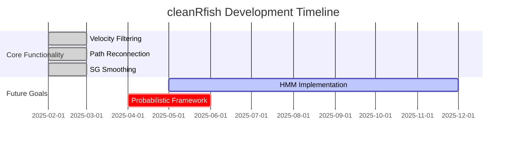

# cleanRfish 🐟📊  
**Trajectory Cleaning for Animal Tracking Data**  
*A PhD Student's Tool for Handling Tracking Software Artifacts*

[](https://www.gnu.org/licenses/gpl-3.0)

## ⚠️ Project Status Note
**Maintainer:** Jack L Manera, PhD Candidate in the School of Biological Sciences, Monash University 
**Maintenance Level:** 🐣 Experimental/Basic (Personal Research Project)  

> **Important Note:** This package is actively used in my PhD research but receives irregular maintenance. While functional for my needs, users should:
> - Expect delayed responses to issues
> - Verify results against raw data
> - Not consider this production-ready software

## 🔍 Problem Addressed
Automated video tracking systems (e.g., EthoVision, idtracker.ai) often exhibit "jumping" artifacts where:
1. Software temporarily locks onto non-target objects
2. Creates artificial discontinuities in trajectories
3. Introduces noise in behavioral analyses

### **Example Cases:**
- Fish temporarily obscured by tank enrichment
- Rodent briefly hidden in complex maze
- Insect lost in high-density tracking

## 📺 Package Overview
### **Current Implementation (Heuristic Approach)**
```r
find_smooth_path(raw_data) %>%
  analyze_behavior()
```
Filters discontinuities using:
- **Velocity Thresholding** (MAD-robust statistics)
- **Path Segmentation**
- **Savitzky-Golay Smoothing**

### **Future Directions (Probabilistic Framework)**
```r
# Goal for v2.0
bayesian_path_cleaner(raw_data, species_movement_model) %>%
  probabilistic_analysis()
```
Planned features:
- **Hidden Markov Models** for state detection
- **Uncertainty quantification**

## 🛠️ Installation
```r
# Install from GitHub
if (!require("devtools")) install.packages("devtools")
devtools::install_github("[yourusername]/cleanRfish")
```

## 🐟 Basic Usage
### **For Zebrafish Tracking Data**
```r
library(cleanRfish)

# Process raw tracking output
cleaned_data <- find_smooth_path(
  raw_df,
  na.fill = TRUE,  # Interpolate gaps
  p = 3,           # Cubic polynomial for SG filter
  n = 13           # 13-point smoothing window
)
```

## 📈 Validation
### **Tested On:**
- Guppies (*Poecilia reticulata*) 2D tracking
- Artificial datasets with controlled jumps

## 🌱 Contributing
While this is primarily a research tool, I welcome:
- **Bug reports** with reproducible examples
- **Documentation improvements**
- **Bayesian methods expertise**

### **Please note:** As a full-time PhD student, I cannot guarantee:
- **Timely responses to issues**
- **Implementation of feature requests**
- **Compatibility with other tracking formats**

## 📝 License
GNU GPLv3 - See LICENSE file

## 📍 Roadmap


## 📨 Contact
For scientific use inquiries:  
**jack.manera@monash.edu**  
Lab Website: **I need a website**  

